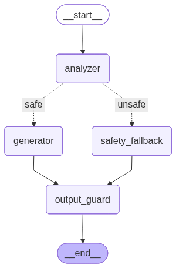

# 🧸 Magic English Companion: AI Tutor for Children

# Project Title: AI-Powered English Learning Chatbot for Children (Under 7 Years Old)
An ultra-fast, stateful AI chatbot designed to teach English to children under 7 years old. Built with **LangGraph**, **LangChain**, and **Streamlit**, this project features dynamic Social and Emotional Learning (SEL), strict content guardrails, and persistent memory tracking.

## Project Directory
```bash 
under-7-chatbot/
│
├── app.py                 # Streamlit UI Layer (Clean & Centered)
├── chat.py                # latency 1-2s code 
├── config.py              # Model initialization
├── requirements.txt       # Dependencies
└── src/
    ├── __init__.py
    ├── state.py           # TypedDict schema
    ├── safety.py          # Safety checks
    ├── nodes.py           # Core logic nodes
    └── graph.py           # Compiled LangGraph Workflow with Checkpointer

```

## 🌟 Core Features
* **Progressive Learning System:** Automatically tracks and adjusts between 3 learning levels (L1: Phonics/Letters, L2: Vocabulary, L3: Simple Sentences).
* **Child Mode Detection (SEL):** Dynamically switches between Learning, Conversation, Engagement, and Support modes based on the child's detected mood.
* **Airtight Guardrails:** Intercepts and deflects medical, cybersecurity, explicit, and aggressive inputs before generation.
* **Persistent Checkpointing:** Utilizes LangGraph's native `MemorySaver` to track conversation continuity and child metrics across isolated threads.

---

## 🏗️ Architecture & Workflow Diagram

The system utilizes a cyclic LangGraph state machine. It evaluates user input for safety and mood simultaneously, routes to the appropriate generation node, and saves the interaction state.



### 🚀 Getting Started

**1. Prerequisites**

Ensure you have Python 3.9+ installed.

**2. Install Requirements**

Clone the repository and install the dependencies:

```bash
git clone https://github.com/Saibhossain/under-7-chatbot.git
cd under-7-chatbot
pip install -r requirements.txt
```

### 3. Environment Variables & API Keys
Create a **.env** file in the root directory of the project. You will need an **OpenAI API key** and **LangSmith** credentials to trace execution latency and token usage.

```bash
OPENAI_API_KEY="your-openai-key"
LANGSMITH_TRACING=true
LANGSMITH_ENDPOINT=https://api.smith.langchain.com
```

## 💻 Running the Application
Launch the interactive Streamlit user interface:

``` bash 
streamlit run app.py
```
* Use the sidebar to start new lessons (creates isolated memory threads).
* Toggle the Debug Mode to view real-time latency, level, mode, and mood tracking directly under the AI's responses.

----

#### 📊 Test Observations & Architecture Trade-offs
During development, rigorous testing was conducted to balance the strict < 2.0s latency requirement against the accuracy of the Social and Emotional Learning (SEL) tracking.

1. **Observation 1: The "Accuracy" Architecture (2.0s - 3.0s Latency)**
When separating the Safety Guardrail and the Mood Analyzer into two distinct LangGraph nodes, the LLM reasoning is nearly perfect.
* **Safety:** Successfully catches aggressive prompts (blocks swearing immediately).
> **SEL Accuracy:** When the child says "I am not happy", the system perfectly switches to [Mode: Support] and [Mood: Sad], providing a comforting response.
* **Trade-off:** End-to-end latency averages 2.3s to 3.5s due to sequential API network round-trips.

2. **Observation 2: The "Speed" Architecture (0.7s - 1.0s Latency)**
To aggressively optimize latency, the Safety Guardrail and Mood Analyzer were combined into a single Pydantic structured output call, and generation tokens were strictly capped.
* **Latency:** Outstanding. End-to-end response times drop to 0.7s - 1.0s.
* **Safety:** Maintains 100% block rate on unsafe inputs (intercepts aggressive text in ~0.87s).
> **Trade-off (Instruction Degradation):** Overloading a small model (gpt-4.1-nano) with a complex combined schema causes minor context loss. When the child says **"I am not happy"**, the model successfully blocks unsafe content but fails the nuanced emotional classification, defaulting to **[Mood: Happy]** and ignoring the SEL Support trigger.

**Conclusion:** For production deployment, splitting the reasoning nodes provides necessary emotional accuracy for children, even if it slightly exceeds the 2-second target.

---

# 👨‍💻 Author
# **Md Saib Hossain**
**AI Engineer • AI / ML / LLM & AI Safety Researcher**  
**Agentic AI Developer • Researcher in Autonomous & Multi-Agent Systems • Advanced Agentic AI Architect**

Designing safe, scalable, and human-centered intelligent systems for real-world healthcare and autonomous AI applications.

<p align="left">
  <a href="mailto:saibhossain5@gmail.com">
    
  </a>
  <a href="https://saibhossain.github.io/">
    
  </a>
  <a href="https://github.com/Saibhossain">
    
  </a>
  <a href="https://linkedin.com/in/saib-hossain-182834229">
    
  </a>
</p>