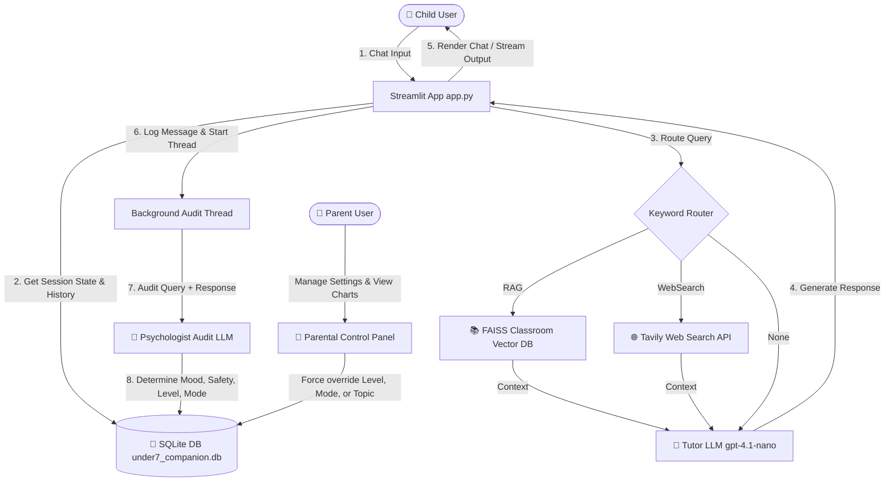

# 🧸 Barnaby the Bear - AI English Companion User Manual

Welcome to **Barnaby's Magic English Adventure**, an empathetic, intelligent, and safe AI English tutor designed specifically for children under 7.

This document serves as the official user manual, outlining how to run and use the system, how the underlying sub-components interact, how the parental control systems work, and the system architecture.

---

## 🛠️ System Architecture

The chatbot utilizes a multi-layered design separating the real-time child-facing tutor logic from the background safety and cognitive analysis.



---

## 🚀 How to Run the System Locally

To run the application locally, execute the following commands in your terminal:

```bash
# 1. Install dependencies
pip install -r requirements.txt

# 2. Run the main Streamlit application
streamlit run full_protopype/app.py
```

Open the local URL generated by Streamlit (usually `http://localhost:8501`) in your web browser.

---

## 🎮 Features & How to Use

The application consists of two main views, switchable via the **Classroom Hub** sidebar:

### 1. 🧸 Kids Playroom
This is the child's interactive chat environment.
*   **Empathy and Interactivity**: Barnaby uses emojis, expressions, and short, highly encouraging sentences to build the child's confidence.
*   **Text-to-Speech (Optional)**: Audio playback is integrated for children who cannot read fluently yet.
*   **Active Topic Focus**: The tutor naturally steers the conversation towards the topic set in the session settings.

### 2. 🔐 Parental Control Panel
A password-protected (default: `parent123`) dashboard allowing parents to monitor progress:
*   **Real-time Metrics**: Live charts displaying conversation count, safety alerts, and mood distribution.
*   **Parental Overrides**: Parents can manually freeze settings:
    *   **Level Override**: Lock the vocabulary depth (L1, L2, L3).
    *   **Mode Override**: Force a specific teaching mode (Learning, Conversation, Support, Engagement).
    *   **Active Topic**: Type in any topic (e.g., "Dinosaurs", "Shapes") to focus the tutor's vocabulary.
*   **Transcript History**: View every turn, matching timestamps, detected moods, and latency analytics.

---

## 📚 Levels of Learning (L1, L2, L3)

The tutor adapts its vocabulary complexity dynamically to the child's age group:

| Level | Target Age | Description & Guidelines | Example Response |
| :---: | :---: | :--- | :--- |
| **L1** | Under 5 | Focuses on single letters, phonetics, and basic nouns. Responses are limited to single-word utterances or ultra-short sound matches. | *"A is for Apple! 🍎 Can you say Apple?"* |
| **L2** | 5 to 6 | Focuses on building vocabulary, colors, shapes, and active descriptions of basic actions. | *"Wow! Green is a lovely color! 🌿 What is green around you?"* |
| **L3** | 6 to 7 | Focuses on full sentences, asking open-ended questions, and prompting short conversational answers. | *"Venus is the second planet! 🌟 It is very bright and hot. Which planet is your favorite?"* |

---

## 🎭 Adaptability Modes (Learning, Conversation, Engagement, Support)

To maintain a healthy emotional and cognitive balance, the system adapts its conversational goal:

*   **Learning**: The structured study mode. Barnaby actively teaches and asks questions related to the active topic (e.g., shapes, solar system).
*   **Conversation**: Casual chat. Barnaby plays along, chats about toys, pets, or hobbies, and builds communication skills without forcing study.
*   **Engagement**: Triggered automatically when the child shows distraction or boredom. Barnaby shifts to tell a tiny 2-sentence joke or ask a playful riddle.
*   **Support**: Triggered when the child expresses sadness, frustration, or negative emotions. Barnaby immediately suspends teaching and responds with validation, love, and comfort.

---

## 🛡️ Safeguards & Safety Interceptor

We implement a two-step safety pipeline to guarantee a secure space:

### 1. The Instant Safety Interceptor (Tutor LLM)
If the child enters unsafe queries containing restricted topics:
*   **Hacking & Cyber-security**
*   **Violence & Bullying**
*   **Medical advice**
*   **Explicit content**

The **Tutor LLM** intercepts the input instantly and diverts the child by responding with a safe game pivot:
> *"Oh, let's play a fun game instead! 🎈 Can you tell me your favorite animal, or should we sing the ABC song?"*

### 2. The Psychologist Audit (Background Thread)
After every turn, the raw query and assistant responses are audited asynchronously using a second LLM configured with structured outputs (`ChildStateAnalysis` schema):
*   It analyzes if the turn was safe and flags any alerts for the parent.
*   It measures the child's emotional state (mood).
*   It recommends mode/level adjustments for the next turn, updating the session's active state in the database.
*   If parent overrides are active, the system preserves parent preferences while continuing to log the diagnostics.

---

## ☁️ Cloud Deployment Configuration

### 🚀 Standard Deployment (Recommended)
Because Streamlit uses WebSockets and background threads, the most reliable and direct deployment path is **Streamlit Community Cloud**, **Render**, or **Railway**:
1. Connect your Github repository.
2. Add your environment variables (e.g., `OPENAI_API_KEY`, `TAVILY_API_KEY`).
3. Set the build command to install dependencies and run: `streamlit run full_protopype/app.py`.

### ⚡ Vercel Deployment Configuration
Vercel is designed for serverless functions (which have a strict execution time limit and do not support persistent WebSockets/long-running background threads). 

A [vercel.json](file:///Users/mdsaibhossain/code/python/under-7-chatbot/vercel.json) file has been created at the root directory to map routing to the app. Note that serverless execution limits and session database write locks (due to serverless concurrency) will affect real-time streaming performance compared to a dedicated PaaS instance.
